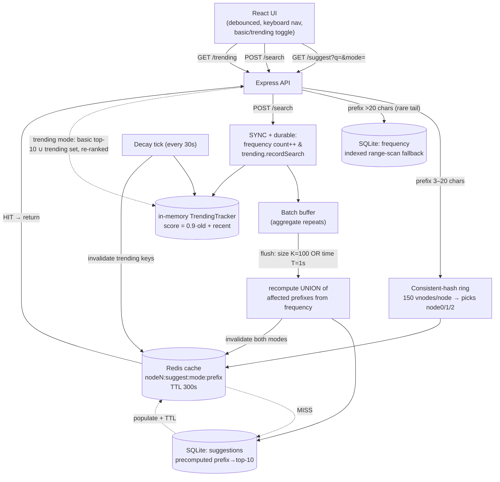

# TypeAhead — search suggestion system (HLD assignment)

A search-as-you-type system: prefix suggestions ranked by popularity (and optionally by
recent activity), fronted by a consistent-hashed Redis cache, backed by SQLite, fed from a
real 35M-row dataset, with batched writes.

- **Design rationale (the graded deliverable):** [DESIGN.md](./DESIGN.md)
- **API reference:** [API.md](./API.md)
- **Performance report:** [PERFORMANCE.md](./PERFORMANCE.md)
- **Build plan / milestone log:** [BUILD.md](./BUILD.md)

---

## Prerequisites
- **Node.js 18+** (developed on v22).
- **Redis** running on `localhost:6379` (developed on Redis 8.8 via Homebrew).
- macOS/Linux shell.

## Setup & run (a few commands)

```bash
# 1. Install dependencies (backend + frontend)
npm install && (cd web && npm install)

# 2. Start Redis
brew services start redis        # or, foreground: redis-server

# 3. Get the dataset (see "Dataset" below), place it, then load it
npm run load                     # builds data/typeahead.db (~110 s)

# 4. Run (two terminals)
npm run dev                      # backend  -> http://localhost:3001
cd web && npm run dev            # frontend -> http://localhost:5173
```

Open the frontend, type ≥3 characters, and use ↑/↓ + Enter. Toggle **Trending mode** to
switch ranking; the **Trending** section shows live recency scores.

## Dataset
- **Source:** Wikimedia Clickstream, English Wikipedia — <https://dumps.wikimedia.org/other/clickstream/>
- **Version used:** `clickstream-enwiki-2026-05.tsv.gz` (~508 MB gzipped, ~35.4M rows).
- **Why this dataset:** counts are pre-computed (the `n` column), millions of rows, no
  privacy baggage; page titles are a fine typeahead proxy (see DESIGN.md §1).
- **Load steps:**
  1. Download the `clickstream-enwiki-YYYY-MM.tsv.gz` file (keep it gzipped).
  2. Save it as `data/clickstream.tsv.gz`.
  3. Run `npm run load`. It streams the gzip, aggregates `GROUP BY curr SUM(n)`, keeps the
     top 200k titles, and precomputes every 3–20 char prefix's top-10.

## Scripts
| Command | What it does |
|---|---|
| `npm run load` | Ingest the dump → SQLite (`frequency` + precomputed `suggestions`). |
| `npm run dev` | Run the backend API (port 3001). |
| `npx tsx scripts/bench.ts` | Latency (p50/p95) + cache hit rate + DB op counts. |
| `npx tsx scripts/ring-demo.ts` | Consistent hashing vs modulo key-movement numbers. |
| `npx tsx scripts/trending-demo.ts` | Trending score climb → decay → drop over periods. |
| `npx tsx scripts/batch-demo.ts` | Batch write-reduction (run while the server is up). |

---

## Architecture

Two stores (the notes' model): a durable **Search Frequency DB** (`frequency`, query→count)
and a precomputed **Top Suggestions DB** (`suggestions`, prefix→top-10), fronted by a
consistent-hashed Redis cache. Reads are O(1) key fetches; writes are batched.



**Read path.** `/suggest` is cache-aside. A 3–20 char prefix is hashed on the ring to a
logical node and looked up in Redis; on a hit it returns immediately, on a miss it reads the
precomputed `suggestions` table and populates the cache (TTL 300s). Prefixes >20 chars (rare)
skip the cache and use an indexed range-scan on `frequency`. Trending mode re-ranks the
basic top-10 unioned with the small recency set — no recompute (DESIGN.md §4).

**Write path.** `POST /search` synchronously bumps the durable `frequency` count and the
in-memory recency score (so counts and recency are always current), then buffers the
expensive prefix recompute. A flush (on size **or** time) recomputes the union of affected
prefixes once and invalidates the affected cache entries.

**Trending.** Every search feeds the in-memory tracker; a background decay tick ages scores
by `0.9` each period and invalidates the trending-mode cache for shifted prefixes.
